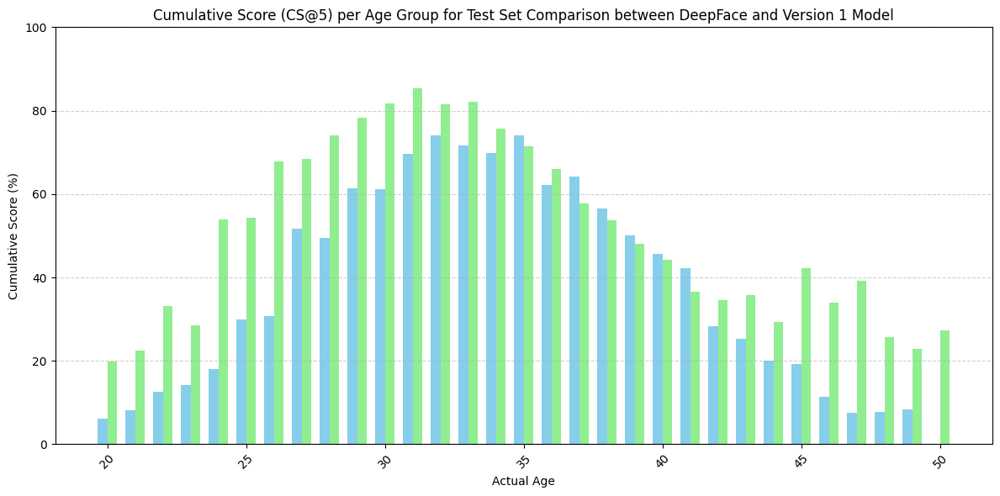

# Age Prediction from Facial Images — Project Summary

## Overview
This project focuses on developing a **robust and scalable machine learning pipeline** to predict a person’s age from facial images. 
The pipeline is designed with considerations for **performance optimization** and potential **edge deployment**.
Please download the html in the documentation folder and view it in the browser instead of just git repo !!
---

## Data Preparation and Analysis
The code for data preparation is in the data_preparation.ipynb notebook where all the steps taken for the data processing and analysis is documented. The HTML is also saved in the documentation folder where all the outputs of the scripts are also saved.

- Implemented a structured data preparation pipeline to handle facial images and associated age labels.  
- For analysis purpose we used csv formats and different version of data.
- Data preprocessing steps included:
  - Data cleaning using open source models. (DeepFace, HaarCascadeDetector)
  - Removing all the images where there are multiple faces, Small faces, No faces.
  - All the images were aligned to the face so that we have consistancy on the data.
  - Normalizing and resizing images for model input consistency.  
  - Splitting the dataset into **train**, **validation**, and **test** subsets.

Since the class distribution is skewed we also would require to balance the class distribution during training our model.

---

## Evaluation 
Since we already had some open source models we evaluated the dataset with the DeepFace model. This is done using the evaluation.ipynb notebook and the outputs are saved in the documentation folder. Here it is also defined about the different metrics we have used for the evaluation purpose. The evaluation of the dataset with DeepFace model shows the following:

- Top 1 Accuracy of DeepFace Age Prediction model: 5.80%
- Cumulative Score (CS) at error level 5: 55.44%
- Cumulative Score (CS) at error level 10: 85.93%
- Mean Absolute Error of DeepFace Age Prediction model: 5.73
- Mean Squared Error of DeepFace Age Prediction model: 53.21
In addition we also used Cumulative score at 5/10 for across all the ages.  

---

## Model Development & Training
The code used for training is train.py and the outputs of the process is stored in the documentaion folder.

- Built a **MobileNetV2** model using **PyTorch**, chosen for its lightweight architecture suitable for **edge devices**.  
- Adapted the model for **regression** by replacing the final classification layer with a single neuron for continuous age prediction.  
- Used **Mean Squared Error (MSE)** as the loss function since the task involves predicting continuous values.  
- Addressed **class imbalance** using a **WeightedRandomSampler**, ensuring fair representation of all age groups during training.  
- Training loop included:
  - Epoch-based optimization using **Adam optimizer**.  
  - **Learning rate scheduling** for stable convergence.  
  - Model checkpointing based on the lowest validation loss.  
  - Real-time progress tracking via **tqdm** progress bars.
Model was versioned as age_prediction_0.0.1.pt and saved in the models folder.
---

## Evaluation
Again we utilized the same evaluation.ipynb notebook for the evaluation of the model and also compared the metrics with the DeepFace model which can be visualized in the documentation for the evaluation.
- Post-training evaluation measured the model’s performance on the test dataset.  
- Metrics focused on **prediction accuracy and error distribution across age ranges**.  
- Visualizations (from the evaluation notebook) were used to assess the correlation between predicted and actual ages.

The above image shows the Cumulative Score per class at level 5 deepface model represented by green bars and trained model represented by blue bars. 

---

## Scalability & Deployment Considerations
We can convert the model using the convert.ipynb which converts the trained model to onnx which can be infered using onnx runtime in C++.

- The pipeline and model are designed for **ONNX conversion**, facilitating **cross-platform inference** and **edge deployment**.  
- The modular architecture supports future enhancements such as:
  - Model quantization for faster inference.  
  - Integration into real-time inference systems.  

---

## Inference Pipeline 
The deployment includes the following.
- inference script to infer the onnx model
- model that is versioned.
Along with the model and the inference script we would normally also version the training script and the data so that the pipeline is reproducable and can be also reproduce in CI/CD pipeline and useful when we move towards MLOPs.
